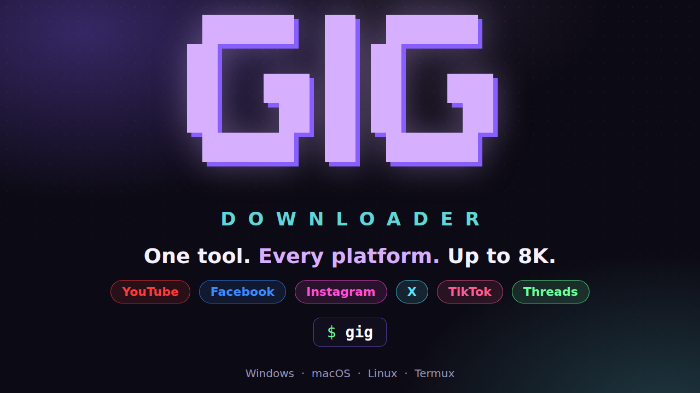

# 🎉GiGDownloader🎉

## 🚀 Installation

### Desktop
##### (MacOS & Linux)
If you have [Homebrew](https://brew.sh/) on macOS:

```bash
brew tap xauusd25/gig https://github.com/xauusd25/GigDownloader
brew install gig

```

Direct install via Terminal (macOS & Linux, no package manager needed):

```bash
curl -fsSL https://raw.githubusercontent.com/xauusd25/GigDownloader/main/install.sh | bash

```

##### (Windows)
If you have [Scoop](https://scoop.sh/):
```powershell
scoop bucket add gig https://github.com/xauusd25/GigDownloader
scoop install gig

```


Direct install via PowerShell (no package manager needed):
```powershell
irm https://raw.githubusercontent.com/xauusd25/GigDownloader/main/install.ps1 | iex

```

> **SmartScreen prompt:** If Windows displays *"Windows protected your PC"*, click **More info** → **Run anyway**.
> 


### Termux (Android)

```bash
termux-setup-storage
curl -fsSL https://raw.githubusercontent.com/xauusd25/GigDownloader/main/install.sh | bash

```

## ⚠️ Disclaimer

GiGDownloader is a personal-use tool built on top of yt-dlp. Only download content you have the right to download — your own posts, content licensed for reuse, or personal/offline use where permitted by law. Respect each platform's Terms of Service and copyright law in your country. The maintainers are not responsible for misuse.

## 🙏 Credits

- [yt-dlp](https://github.com/yt-dlp/yt-dlp) — the download engine this tool wraps
- [ffmpeg](https://ffmpeg.org/) — audio/video processing and merging

## 📄 License

This project is licensed under the [MIT License](LICENSE).
